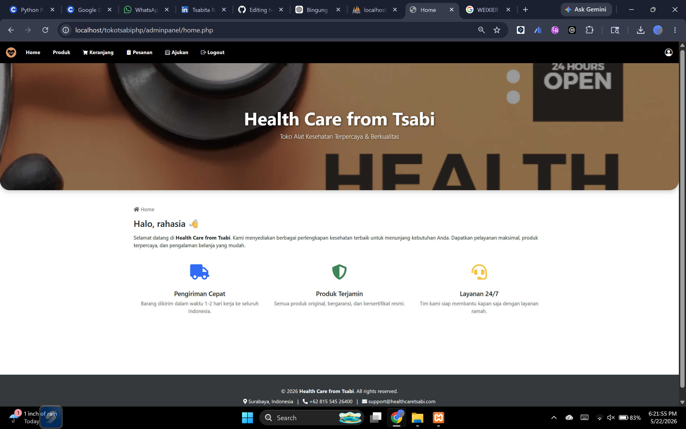
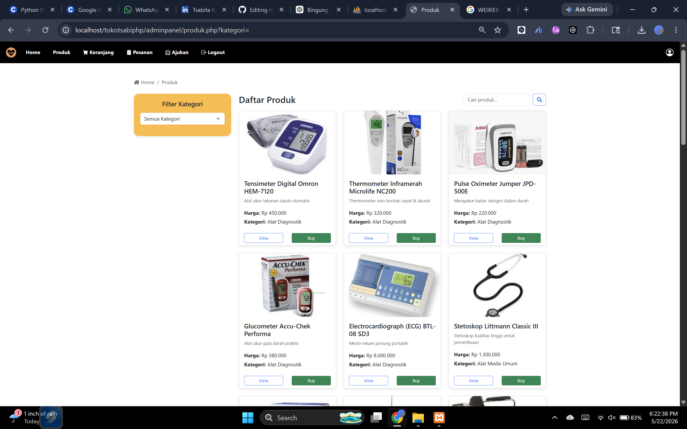
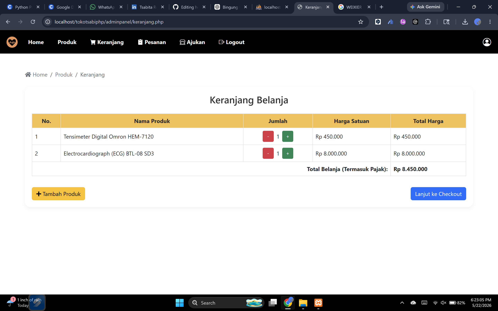
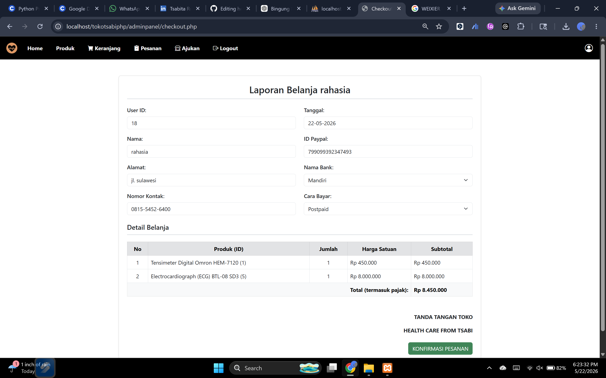
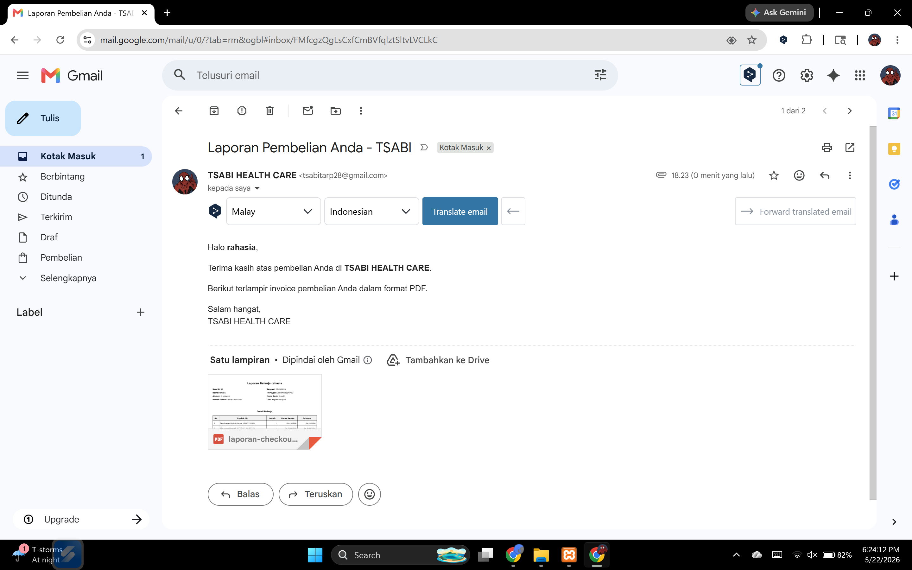

# healthcare-store-php
A PHP and MySQL-based medical equipment store website featuring authentication, product catalog, purchasing system, and automated purchase report delivery via email with transaction details and total payment.

## 💻 Local Development

Run the project locally using XAMPP:

```bash
http://localhost/tokotsabiphp/adminpanel/home.php
```

## 🚀 Features
- User Authentication
- Product Catalog
- Product Categories
- Purchase Interface
- Automated Purchase Report via Email
- Total Payment Calculation
- Responsive User Interface

---

## 🛠️ Technologies Used

- PHP Native
- MySQL
- HTML5
- CSS3
- Bootstrap
- XAMPP
- PHPMailer
- TCPDF / FPDF

---

## 📸 Project Preview

### Option Page


### Register Page


### Login Page


### Home Page


### Product Page


### Shopping Cart Page


### Report Page


### Email Report


### PDF Report
.png)
