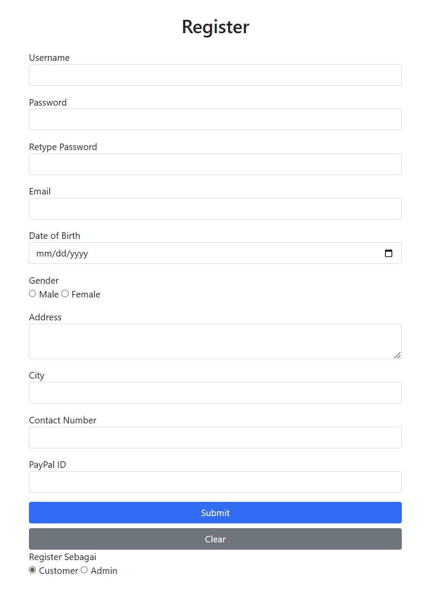

# healthcare-store
A PHP and MySQL-based medical equipment store website featuring authentication, product catalog, purchasing system, and automated purchase report delivery via email with transaction details and total payment.

## 🚀 Features
- User Authentication
- Product Catalog
- Product Categories
- Purchase Interface
- Automated Purchase Report via Email
- Total Payment Calculation
- Responsive User Interface

---

## 🛠️ Technologies Used

- PHP Native
- MySQL
- HTML5
- CSS3
- Bootstrap
- XAMPP
- PHPMailer
- TCPDF / FPDF

---

## 📸 Project Preview

### Option Page

### Register Page

### Login Page

### Home Page

### Product Page

### Shopping Cart Page

### Report Page

### Email Report

